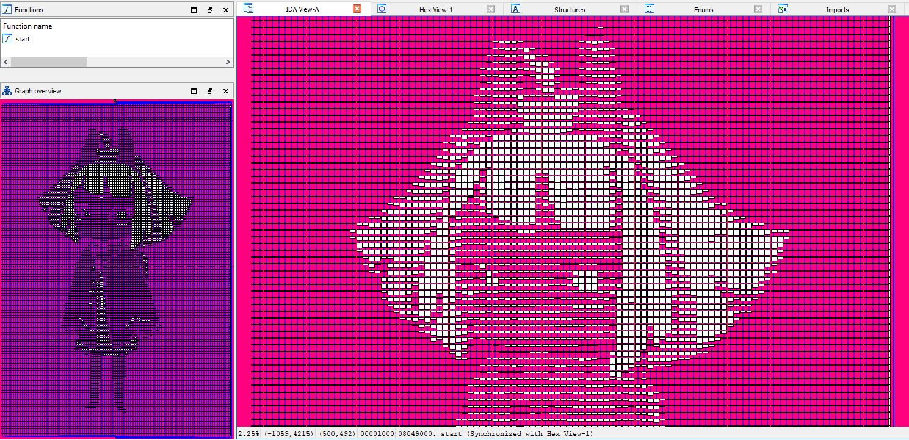

# Artfuscator

A better approach towards psychological warfare against reverse engineers.

## Overview

Artfuscator is a cursed C compiler built on the work of [ELVM](https://github.com/shinh/elvm). It translates C code into a single controlflow graph that takes the form of any image of choice:


## Wait a minute, didn't [REPsych](https://github.com/xoreaxeaxeax/REpsych) already do this?

Yes and no. 

[REPsych](https://github.com/xoreaxeaxeax/REpsych) generates a controlflow graph that looks like an image and personally I've deemed such a sight traumatic to behold. However, there is a critical flaw in REPsych's approach: The controlflow graph has no functionality! This means that once an engineer takes a closer look, they'll realise that their fear was a bluff: They don't have to actually reverse it after all!

Building on the ideas pioneered by REPsych, Artfuscator gives credence to such a fear: The artistic controlflow graph implements the functionality of the program. Not only that, the graph is THE ONLY GRAPH that implements the entire function of the program! The only way to reverse the program is to dive deep into the individual pixels making up the image, ensuring maximum trauma inflicted.

## Usage

So a fair bit of warning, I didn't bother to package this project properly. The MIT License does not hold me liable to any damage caused from using this project.

### Setting up

```bash
# Clone all the submodules
git submodule update --recursive --init --remote

# Build elvm with my bespoke backend
cd elvm
make art
cd ..
```
You would also need Python3 and nasm installed.

### Building

Create your C source file in the project's root directory (e.g. `hewwo.c`), and in the same directory, run `make <target> IMG=<filename>` (e.g. `make hewwo IMG=etc/niko-grey.png`). The final binary is compiled in the `dist` folder.

Note that `IMG` must point to a single-channel greyscale image (mode L).

## Examples

### hewwo


### lisp




## How it works

TODO

## Credits

> [Christopher Domas](https://twitter.com/xoreaxeaxeax) for the original idea and work on REPsych
> [Shinh](https://github.com/shinh/elvm) for ELVM, which is an awesome project